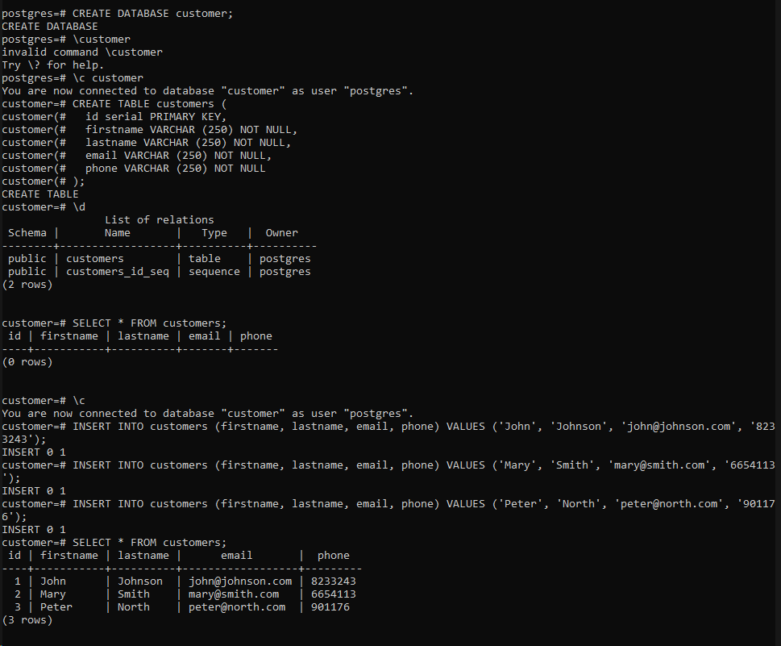

# Customer database

1.) Create a Postgre database called customer using the following SQL statement.

```console
CREATE DATABASE customer;
```

2.) Connect to the customer database (\c customer command) and create a table called customers into the customer database using the following SQL statement.

```console
CREATE TABLE customers (
  id serial PRIMARY KEY,
  firstname VARCHAR (250) NOT NULL,
  lastname VARCHAR (250) NOT NULL,
  email VARCHAR (250) NOT NULL,
  phone VARCHAR (250) NOT NULL
);

```
3.) Populate the customers table using the SQL statement below.

```console
INSERT INTO customers (firstname, lastname, email, phone) VALUES ('John', 'Johnson', 'john@johnson.com', '8233243');
INSERT INTO customers (firstname, lastname, email, phone) VALUES ('Mary', 'Smith', 'mary@smith.com', '6654113');
INSERT INTO customers (firstname, lastname, email, phone) VALUES ('Peter', 'North', 'peter@north.com', '901176');
```

4.) Check that customers are added to the customers table

```console
SELECT * FROM customers;
```

